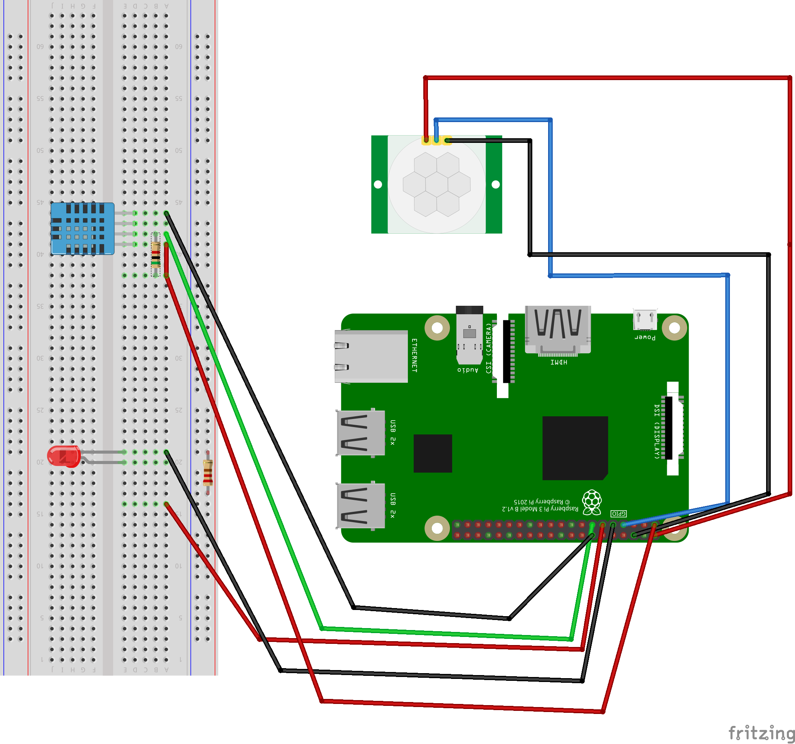
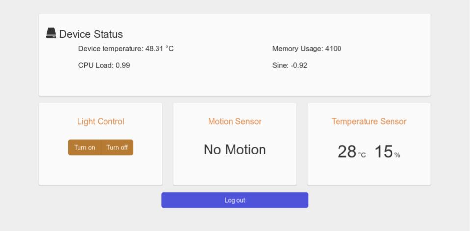
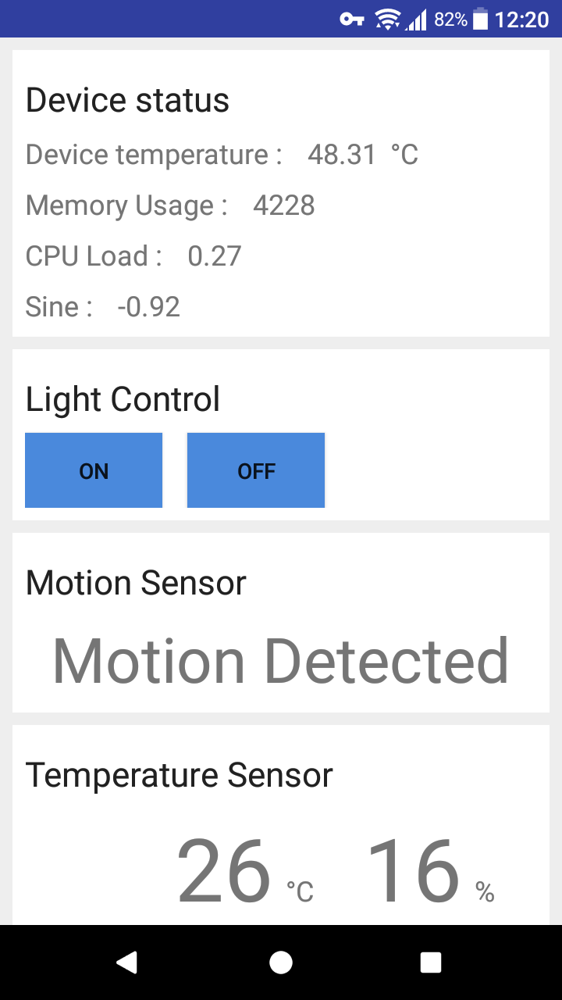

这是我的毕业项目——基于树梅派的简单物联网系统。   
在该项目在 IBM Bluemix 云计算平台上搭建，了解 Bluemix 的更多信息，请访问：[IBM Bluemix](https://www.ibm.com/cloud-computing/bluemix/)。项目总共分为三个部分：本地设备端(Client Side)、服务器端(Server Side)、手机应用端(Android App)。用户可以在浏览器或是手机应用程序上获取与本地设备相连的传感器信息，并且可以控制 LED 灯开关。

## 本地设备端
电路如图所示：   

本地设备端使用 Python 编程，通过[MQTT](https://en.wikipedia.org/wiki/MQTT)连接到 Bluemix 服务器。   

## 服务器端
服务器端使用 Node.js ，通过 `ibmoitf` 组件连接到 IBM IOT 服务，获取本地传感器数据。使用`socket.io`实现与先端网页的实时通信。   
通过浏览器访问的结果：  

## 手机应用端
使用[`socket.io-client-java`](https://github.com/socketio/socket.io-client-java)连接到 Node.js 服务器，与前端网页类似。   
应用程序运行效果：   
